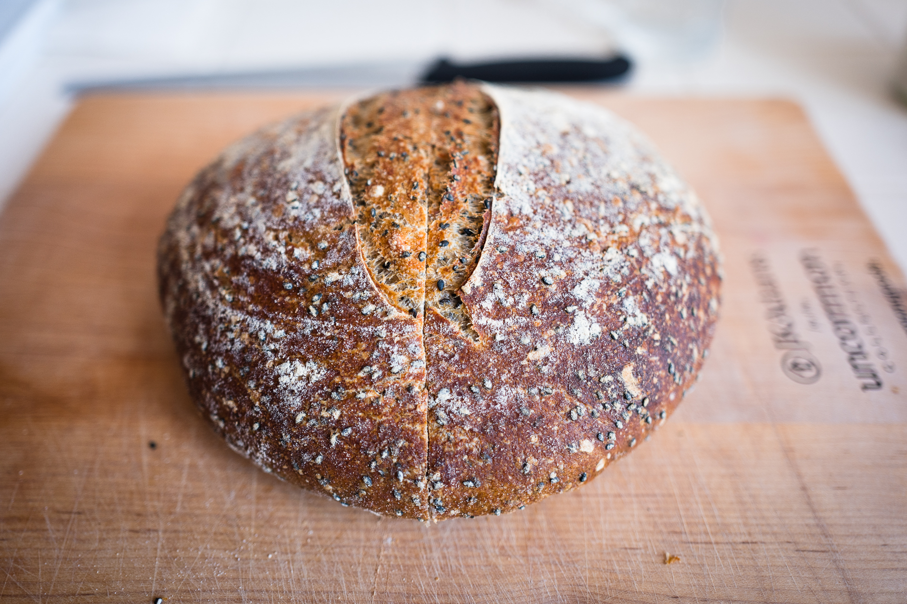

- 25% whole wheat, rest was bread flour. 1 cup black sesame seeds lightly toasted (~2 mins)
- Started autolyse at 9:10am
- Mix ended at 1pm (about 4 hour autolyse)
- 82.5% hydration
- Fold at 1:40pm, 2:05pm, 2:25pm, 3pm. 
- Pre Shaped at 4:30pm
- In bannetons at 5pm
- Can’t remember when in. Fridge 7:30?
- Baked around 10:30pm

