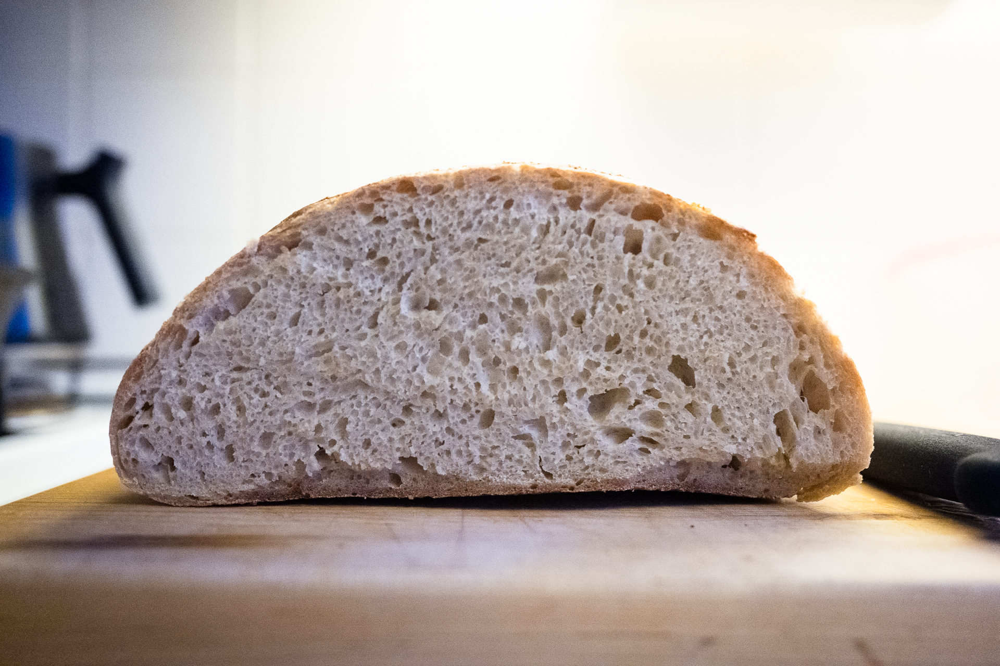

Following my [recipe v.1](/entries/bread-recipe-v.1) with noted changes. This loaf is:

- 33% whole wheat
- 9% all purpose flour (because I ran out of bread flour)
- 67% bread flour

Flour is hard to find, because everyone is baking now that they're at home. Angi bought a 5lb bag of flour that we're splitting.

Overnight levain with starter diluted 1 in 11. Started autolyse at 11am, planned a 2 hour autolyse but it was more like 2.5 hours. Started mix around 1:30pm, started the clock on bulk at 1:45pm. Rubaud mixed 10 mins.

I had to add water as I mixed to get the dough to the consistency I’m used to. I think the ww flour takes more water. Not sure how much I added.

Stretch and folds at 1 hour, 1.5 hours, 2 hours. About 6:45pm, I preshaped. Dough rose much more than N° 21 likely because of the whole wheat. Bench rest for 15 mins, shaped, then another 15 mins on bench. In baskets.

Loaves were already filling a lot of the basket, but they didn’t pass the poke test. I let proof until 8:15pm. I think they still didn’t pass. Poke sprung back pretty quickly but didn’t spring back all the way. 

I put in the fridge anyway at 8:15pm, because its been 6.5 hours since mixing and the dough looks to have risen quite a bit.

Excellent oven spring and crust. Crumb is good, though quite even with holes that could be bigger. Taste is good though noticeably sour.

**Next, wait on proof till it passes the poke test. Try 4-6 hour autolyse, and with more water, say 800g instead of 750. Make sure dough isn’t dry during autolyse.**

