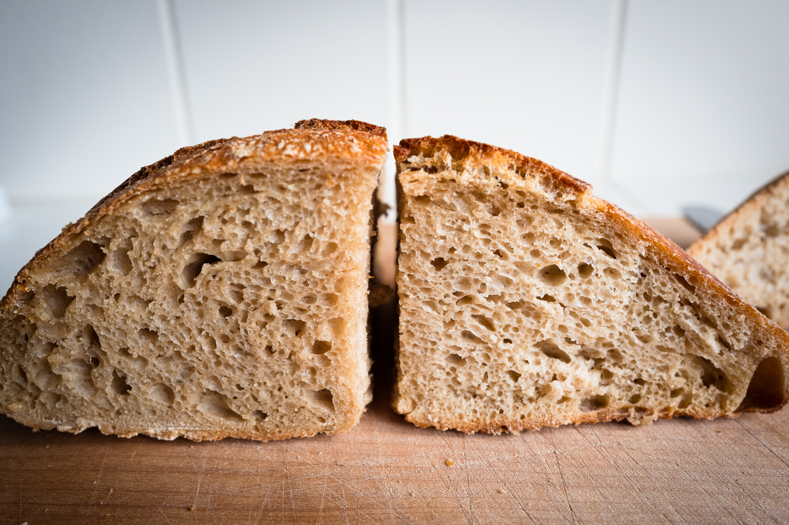

Following my [recipe v.1](/entries/bread-recipe-v.1) with noted changes. This loaf is:

- 33% whole wheat
- 67% all purpose flour (I ran out of bread flour)

Overnight 1 in 5 levain gets levain ready earlier next day.
Started autolyse around 8:30am. Mixed levain and brought up to 80% hydration. Dough felt dry so I kept adding water, maybe too much because it got to about the limit of what was easy to handle (as I found out later during shaping).

Mixed at 1:30pm (later than I wanted). Did about 4-5 folds every 15 - 30 minutes. I did more frequent folds because this has AP flour and was so wet. Tried to keep at 80°F but it got too hot and was closer to 85°F.

Bulk looked done after 2.5 hours. Preshaped, rested 15 mins, shaped, then in bannetons at 4:45pm. Shaping was tricky but went fine. Kept at RT for proof. Proofed for 2 hours. In fridge overnight.

Crumb is very good, open and shaggy in parts. Not quite as much oven spring as N° 22, maybe because of the AP (vs bread) flour.

