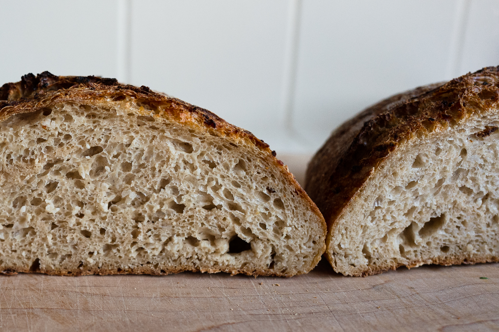
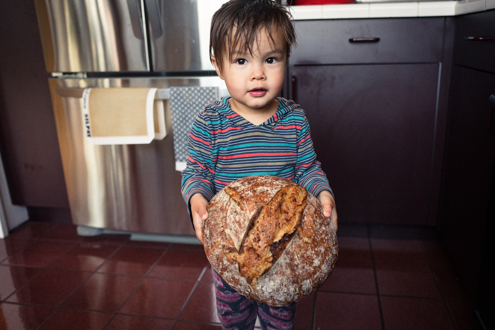

I've been wanting to make the Koji bread from Tartine Book No. 3 for a while now. Where did this come from? I had some Koji sitting in the freezer (probably for too long) from when I first made garum well over a year ago. This past summer, in the middle of the pandemic, I got interested in the Koji again and made some smoked rice amazake that I then made into mouse and ice cream.

I've been thinking off and on about porridge breads and using koji since then but never had a good source for koji, since I don't really want to cross the bridge to go to Berkeley Bowl just for koji. Then I found a place to buy it online, [amazakeco.com](https://amazakeco.com/) and here we are.

I bought some koji for myself and Angi; she's making the same bread too this weekend.

## Tasting

Crumb is typical for me, open and regularly spaced holes, not molten. The flavor is good, but the effect of the koji is subtle. The sweetness is there but could be sweeter. The crust seems to be a deeper color than usual, with an almost reddish tint to it.

If I do koji again, I'd soak at 140°F for a couple hours before boiling. I might also try mixing koji with oatmeal to do a kind of mixed porridge bread.

## Notes

The recipe is my standard sourdough loaf, adapted to use koji based on the Tartine Book No. 3 koji porridge bread recipe. The Tartine recipe calls for 50% baker's percentage of koji porridge (including dry koji and water). I wanted my loaves to be their usual size, so I scaled my entire recipe down so that the total recipe weight (including the koji) is the same as my usual recipe (2,200 g including flour, water, levain).

#### Dough

| Ingredient        | Amount |
| ------------------|--------|
| White flour       | 800 g  |
| Whole wheat flour | 100 g  |
| Water             | 750 g  |
| Levain            | 180 g  |

#### Koji porridge

| Ingredient        | Amount |
| ------------------|--------|
| Koji              | 150 g  |
| Water             | 300 g  |

I lowered the amount of water in the dough so that the total water, including water in the porridge is 1,050 g.

- RT autolyse for 3 hours with flour and 700 g water
- Started bulk at 5:30 pm
- Folded at 30 mins, 60 mins, and hourly after that
- Boiled koji in water for about 10 or so minutes. Eventually the koji absorbed the water like when making rice.
- Cooled the koji porridge and folded into the dough at 1 hour.
- Ended bulk around 10 p
- 90 min proof at RT, then in the fridge overnight

The dough didn't seem to wet, maybe because the koji absorbs a lot of water so the 300 g in the porridge doesn't really contribute to hydration in the way that you'd expect.

The Tartine recipe calls for boiling the koji, which I did. I realized this will inactivate the enzymes in the koji, so you won't get much in the way of sweet or savory flavors other than what's already in it. I think it is a good idea to inactivate the koji, because otherwise it might break down gluten while rising. Next time I should let the koji sit in 140°F water for some time, then boil.

Tartine calls for baking at a temperature 10-15% lower than their master recipe, because sugars in the koji caramelize and can cause the crust to brown before the interior of the bread is done.

I adapted my usual bake recipe to preheat at 550°F then dropped to 425°F once the loaf went in. Timing was typical: 20 mins with lid on, about 40 minutes with lid off.

