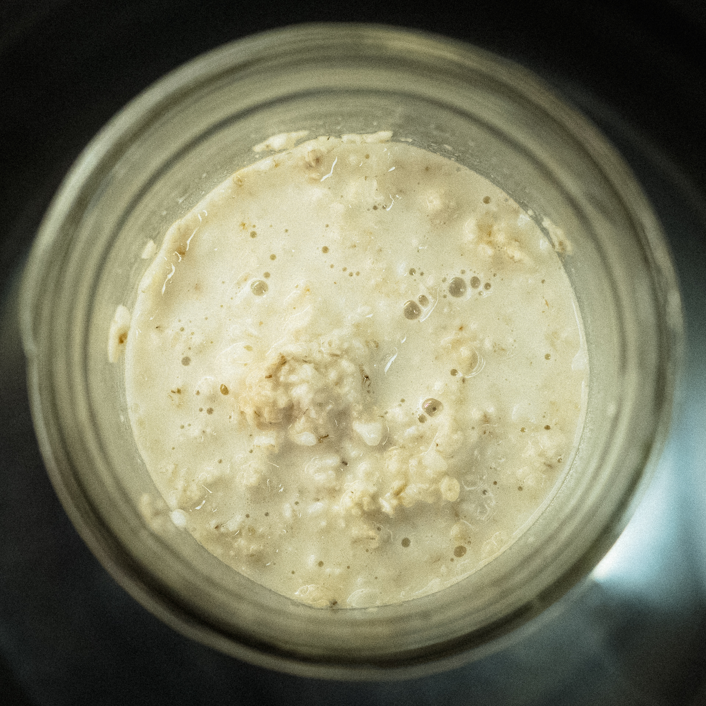

## v.2

- 50 g koji
- 100 g instant oats
- 400 g whole milk
- 1 tbsp peanut butter

Heated up to 140°F then put in a warm oven and reheated as needed to keep around 140°.

## v.1

- 90 g koji
- 90 g instant oats
- 360 g water at 140°F

11pm, combined above in a glass jar and stirred, then put in a water bath in the instant pot set to 140°F. I loosely put a lid on the jar.

Next morning blended to smooth and mixed with a little half and half. I found that its best as a drink when diluted with hot water.

Next, try 1 part koji to 2 parts oats, and use milk instead of water to get more protein for the koji to work on.
